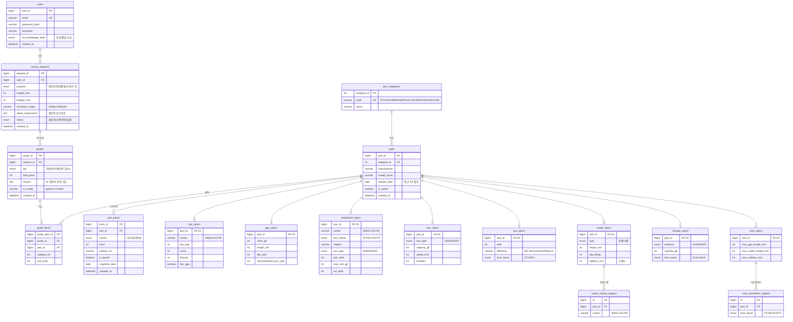

# DB 설계 — ERD & 릴레이션 스키마

> 대상: AI 기반 커스텀 PC 견적 추천 서비스 · DBMS: MySQL 8.x (InnoDB)
> 설계 원칙: readme의 "**SQL 연산으로 호환 부품 후보군(Pool) 선별**"이 실제로 가능하도록
> 부품 규격(소켓·폼팩터·전력·치수)을 정규화된 컬럼으로 구조화한다.

---

## 1. 도메인 요약

```
회원(users) ──▶ 견적요청/설문(survey_requests) ──▶ 3종 견적(quotes) ──▶ 견적 부품(quote_items)
부품카테고리(part_categories) ──▶ 부품마스터(parts) ──▶ 카테고리별 규격(*_specs)  ▶ 호환성 SQL의 핵심
                                              └──▶ 가격 캐싱(part_prices)  ▶ 일 배치 업데이트
```

핵심 흐름: **users → survey_requests → (룰 필터링 + AI) → quotes(3종) → quote_items**
부품 쪽은 **parts + 카테고리별 규격 테이블**로 나눠 호환성 검사에 필요한 컬럼을 명확히 둔다.

---

## 2. ERD (Mermaid)



---

## 3. 릴레이션 스키마 (관계형 표기)

밑줄 = PK, *별표* = FK

```
users( _user_id_, email, password_hash, nickname, hw_knowledge_level, created_at )

survey_requests( _request_id_, *user_id*, purpose, budget_min, budget_max,
                 resolution_target, detail_requirement, status, created_at )

part_categories( _category_id_, code, name )

parts( _part_id_, *category_id*, manufacturer, model_name, release_date, is_active, created_at )

part_prices( _price_id_, *part_id*, source, price, product_url, is_lowest, snapshot_date, updated_at )

quotes( _quote_id_, *request_id*, tier, total_price, reason, ai_model, created_at )

quote_items( _quote_item_id_, *quote_id*, *part_id*, category_id, unit_price )

-- 카테고리별 규격 (part_id 를 PK 겸 FK 로 공유 = 1:1 서브타입)
cpu_specs( _*part_id*_, socket, tdp_watt, cores, threads, has_igpu )
gpu_specs( _*part_id*_, vram_gb, length_mm, tdp_watt, recommended_psu_watt )
mainboard_specs( _*part_id*_, socket, form_factor, chipset, ram_type, ram_slots, max_ram_gb, m2_slots )
ram_specs( _*part_id*_, ram_type, capacity_gb, speed_mhz, modules )
psu_specs( _*part_id*_, watt, efficiency, form_factor )
cooler_specs( _*part_id*_, type, height_mm, tdp_rating, radiator_mm )
storage_specs( _*part_id*_, interface, capacity_gb, form_factor )
case_specs( _*part_id*_, max_gpu_length_mm, max_cooler_height_mm, max_radiator_mm )

-- 다대다(M:N) 관계
case_formfactor_support( _id_, *part_id*, form_factor )
cooler_socket_support( _id_, *part_id*, socket )
```

---

## 4. 호환성 검사 규칙 → SQL 매핑 (핵심)

readme 2.1단계의 호환성 검사가 아래 조인 조건으로 실현된다.

| 검사 항목 | 조건 |
|---|---|
| CPU ↔ 메인보드 소켓 | `cpu_specs.socket = mainboard_specs.socket` |
| 메인보드 ↔ RAM 규격 | `mainboard_specs.ram_type = ram_specs.ram_type` |
| 메인보드 ↔ 케이스 폼팩터 | `mainboard_specs.form_factor IN (case_formfactor_support.form_factor)` |
| GPU ↔ 케이스 길이 | `gpu_specs.length_mm <= case_specs.max_gpu_length_mm` |
| 쿨러 ↔ 케이스 높이 | `cooler_specs.height_mm <= case_specs.max_cooler_height_mm` |
| 쿨러 ↔ CPU 소켓 | `cpu_specs.socket IN (cooler_socket_support.socket)` |
| 파워 권장 출력 | `psu_specs.watt >= gpu_specs.recommended_psu_watt` (또는 부품 TDP 합산) |
| 최신성 (최근 2년) | `parts.release_date >= DATE_SUB(CURDATE(), INTERVAL 2 YEAR)` |

이렇게 걸러진 부품 Pool을 구조화 JSON으로 Gemini에 전달 → 3종 견적 생성(`quotes`/`quote_items`에 저장).

---

## 5. 설계 포인트

- **서브타입 분리**: 카테고리마다 규격 컬럼이 완전히 달라서, EAV(key-value) 대신 카테고리별 규격 테이블을 두어 **호환성 조인이 타입 안전하고 인덱스 활용 가능**하도록 함.
- **가격 분리**: `part_prices`를 별도 테이블로 두어 일 배치가 부품 마스터를 건드리지 않고 가격만 갱신(`snapshot_date`로 이력 관리, `is_lowest`로 최저가 캐싱).
- **견적 스냅샷**: `quote_items.unit_price`에 생성 시점 가격을 박제해, 이후 가격이 변해도 과거 견적이 보존됨.
- **인덱스 권장**: `parts(category_id, release_date)`, `part_prices(part_id, snapshot_date)`, 각 규격 테이블의 `socket`/`form_factor`/`ram_type`.
```
```

---

다음 단계 후보:
- ✅ 위 스키마의 **MySQL DDL(CREATE TABLE) 파일** 생성
- MySQL 설치 후 실제 DB에 적용
